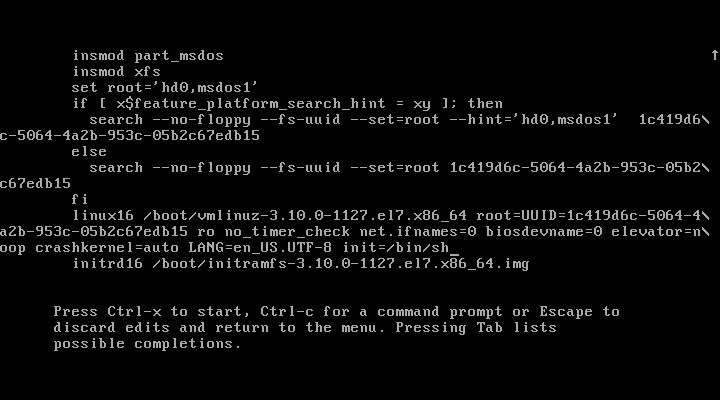
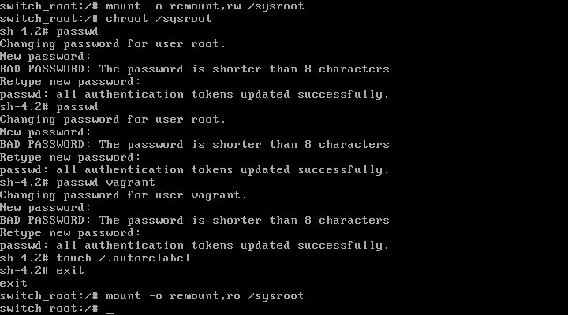

# 1. Попасть в систему без пароля несколькими способами.
## 1.1 init=/bin/sh
 - При загрузке нажимаем `e`
 - Редактируем строку начинающуюся на `linux16` убираем параметры `console` и добавляем `init=/bin/sh`
 - ctrl+x



```bash
mount -o remount,rw /

passwd

passwd vagrant

```

vi /etc/selinux/config меняем SELINUX=enforcing на disabled

```bash
sync

exec /sbin/init
```


## 1.2 rd.break

1. Редактируем строку начинающуюся на `linux16` убираем параметры `console` и добавляем `rd.break` (опционально убираем quiet)


2. Загружаемся нажимаем Ctrl - x

3. Смотрим список смонтированных файловых систем. Ищем /sysroot
```bash
mount
```

4. Перемонтируем  в режиме rw /sysroot.  
```bash
mount -o remount,rw /sysroot
```
5. Проверяем командой mount что /sysroot примонтирован в rw режиме (чтение-запись)
```bash
mount
```

6. Заходим в образ системы 
```bash
chroot /sysroot
```

7. Изменяем пароль пользователя командой
```bash
passwd
```

Т.к. разрешен selinux - создаем файл .autorelabel. (по умолчанию разрешен) Выполняем команду
```bash
touch /.autorelabel
```

Команда exit выходим из chroot.
```bash
exit
```

Перемонтируем  в ro (read only)  
```bash
mount -o remount,ro /sysroot
```

Список команд bash
```bash
mount -o remount,rw /sysroot

chroot /sysroot

passwd

passwd vagrant

touch /.autorelabel

exit

mount -o remount,ro /sysroot

exec /sbin/init
```





