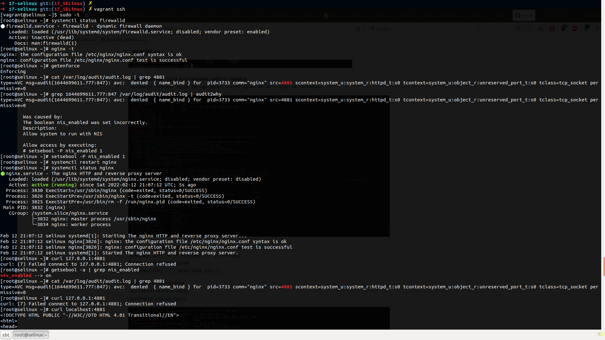
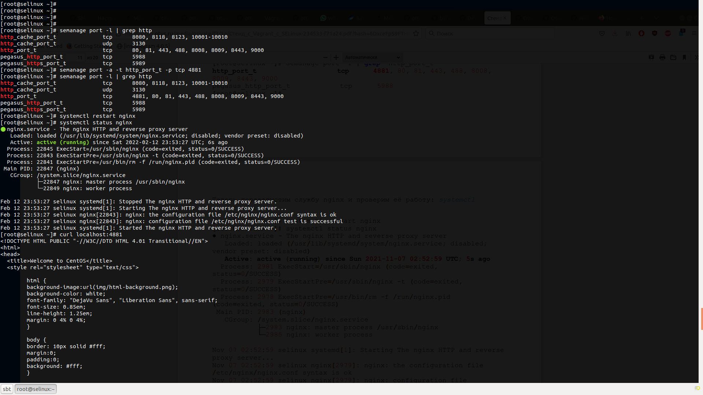
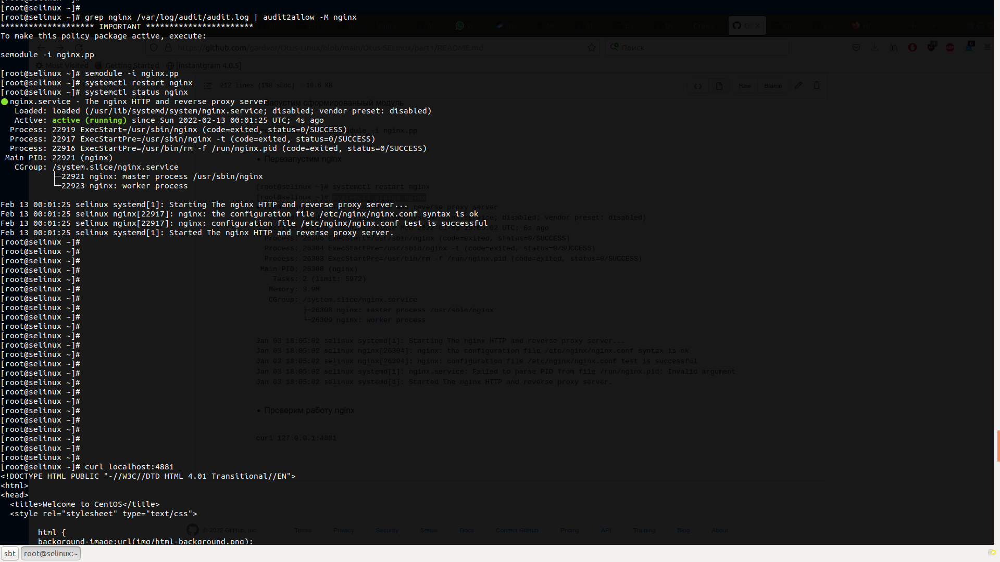

# Запустить nginx на нестандартном порту 3-мя разными способами

## Что требуется
Требуется установленное программное обеспечение

Hashicorp Vagrant, Oracle VirtualBox

## Как запустить
Скачать все файлы в одну директорию, из директории с vagrantfile выполнить команду Vagrant up

## Домашнее задание
* Копируем все файлы из репозитория в одну папку
* Запускаем проект командой
```
vagrant up
```
* Vagrant выдает ошибку при запуске nginx
```
	selinux: Job for nginx.service failed because the control process exited with error code. See "systemctl status nginx.service" and "journalctl -xe" for details.
	selinux: ● nginx.service - The nginx HTTP and reverse proxy server
	selinux:    Loaded: loaded (/usr/lib/systemd/system/nginx.service; disabled; vendor preset: disabled)
	selinux:    Active: failed (Result: exit-code) since Sat 2022-02-12 21:00:11 UTC; 9ms ago
	selinux:   Process: 3733 ExecStartPre=/usr/sbin/nginx -t (code=exited, status=1/FAILURE)
	selinux:   Process: 3732 ExecStartPre=/usr/bin/rm -f /run/nginx.pid (code=exited, status=0/SUCCESS)
	selinux: 
	selinux: Feb 12 21:00:11 selinux systemd[1]: Starting The nginx HTTP and reverse proxy server...
	selinux: Feb 12 21:00:11 selinux nginx[3733]: nginx: the configuration file /etc/nginx/nginx.conf syntax is ok
	selinux: Feb 12 21:00:11 selinux nginx[3733]: nginx: [emerg] bind() to [::]:4881 failed (13: Permission denied)
	selinux: Feb 12 21:00:11 selinux nginx[3733]: nginx: configuration file /etc/nginx/nginx.conf test failed
	selinux: Feb 12 21:00:11 selinux systemd[1]: nginx.service: control process exited, code=exited status=1
	selinux: Feb 12 21:00:11 selinux systemd[1]: Failed to start The nginx HTTP and reverse proxy server.
	selinux: Feb 12 21:00:11 selinux systemd[1]: Unit nginx.service entered failed state.
	selinux: Feb 12 21:00:11 selinux systemd[1]: nginx.service failed.
```
* Подключаемся к виртуальной машине
```
vagrant ssh
```
* Проверяем работает ли Firewall
```
[root@selinux ~]# systemctl status firewalld
● firewalld.service - firewalld - dynamic firewall daemon
   Loaded: loaded (/usr/lib/systemd/system/firewalld.service; disabled; vendor preset: enabled)
   Active: inactive (dead)
     Docs: man:firewalld(1)
```
* Проверяем корректность конфигурации nginx
```
[root@selinux ~]# nginx -t
nginx: the configuration file /etc/nginx/nginx.conf syntax is ok
nginx: configuration file /etc/nginx/nginx.conf test is successful
```
* Проверяем режим работы SELinux
```
[root@selinux ~]# getenforce
Enforcing
```
### Разрешим в SELinux работу nginx на порту TCP 4881 c помощью переключателей setsebool
* Находим в логах информацию о блокировании порта
```
cat /var/log/audit/audit.log | grep 4881
type=AVC msg=audit(1644699611.777:847): avc:  denied  { name_bind } for  pid=3733 comm="nginx" src=4881 scontext=system_u:system_r:httpd_t:s0 tcontext=system_u:object_r:unreserved_port_t:s0 tclass=tcp_socket permissive=0
```
* Смотрим информацию об ошибке с помощью утилиты Audit2why
```
[root@selinux ~]# grep 1644699611.777:847 /var/log/audit/audit.log | audit2why
type=AVC msg=audit(1644699611.777:847): avc:  denied  { name_bind } for  pid=3733 comm="nginx" src=4881 scontext=system_u:system_r:httpd_t:s0 tcontext=system_u:object_r:unreserved_port_t:s0 tclass=tcp_socket permissive=0

        Was caused by:
        The boolean nis_enabled was set incorrectly.
        Description:
        Allow system to run with NIS

        Allow access by executing:
        # setsebool -P nis_enabled 1
```
* Включим параметр nis_enabled и перезапустим nginx
```
[root@selinux ~]# setsebool -P nis_enabled 1
[root@selinux ~]# systemctl restart nginx
[root@selinux ~]# systemctl status nginx
● nginx.service - The nginx HTTP and reverse proxy server
   Loaded: loaded (/usr/lib/systemd/system/nginx.service; disabled; vendor preset: disabled)
   Active: active (running) since Sat 2022-02-12 21:07:12 UTC; 5s ago
  Process: 3830 ExecStart=/usr/sbin/nginx (code=exited, status=0/SUCCESS)
  Process: 3826 ExecStartPre=/usr/sbin/nginx -t (code=exited, status=0/SUCCESS)
  Process: 3825 ExecStartPre=/usr/bin/rm -f /run/nginx.pid (code=exited, status=0/SUCCESS)
 Main PID: 3832 (nginx)
   CGroup: /system.slice/nginx.service
		   ├─3832 nginx: master process /usr/sbin/nginx
		   └─3834 nginx: worker process

Feb 12 21:07:12 selinux systemd[1]: Starting The nginx HTTP and reverse proxy server...
Feb 12 21:07:12 selinux nginx[3826]: nginx: the configuration file /etc/nginx/nginx.conf syntax is ok
Feb 12 21:07:12 selinux nginx[3826]: nginx: configuration file /etc/nginx/nginx.conf test is successful
Feb 12 21:07:12 selinux systemd[1]: Started The nginx HTTP and reverse proxy server.
```
* Проверим работу nginx
```
[root@selinux ~]# curl 127.0.0.1:4881
curl: (7) Failed connect to 127.0.0.1:4881; Connection refused
[root@selinux ~]# curl localhost:4881
<!DOCTYPE HTML PUBLIC "-W3CDTD HTML 4.01 Transitional//EN">
<html>
<head>
  <title>Welcome to CentOS</title>
  <style rel="stylesheet" type="text/css"> 

...
```
* Проверим статус параметра nis_enabled
```
[root@selinux ~]# getsebool -a | grep nis_enabled
nis_enabled --> on
```
* Вернем запрет работы nginx
```
[root@selinux ~]# setsebool -P nis_enabled 0
```




### Разрешим в SELinux работу nginx на порту TCP 4881 c помощью добавления нестандартного порта в имеющийся тип

* Поиск имеющегося типа, для http трафика:
```
[root@selinux ~]# semanage port -l | grep http
http_cache_port_t              tcp      8080, 8118, 8123, 10001-10010
http_cache_port_t              udp      3130
http_port_t                    tcp      80, 81, 443, 488, 8008, 8009, 8443, 9000
pegasus_http_port_t            tcp      5988
pegasus_https_port_t           tcp      5989
```
* Добавим порт в тип http_port_t:
```
[root@selinux ~]# semanage port -a -t http_port_t -p tcp 4881
[root@selinux ~]# semanage port -l | grep http
http_cache_port_t              tcp      8080, 8118, 8123, 10001-10010
http_cache_port_t              udp      3130
http_port_t                    tcp      4881, 80, 81, 443, 488, 8008, 8009, 8443, 9000
pegasus_http_port_t            tcp      5988
pegasus_https_port_t           tcp      5989
```
* Перезапускаем nginx
```
[root@selinux ~]# systemctl restart nginx
[root@selinux ~]# systemctl status nginx
● nginx.service - The nginx HTTP and reverse proxy server
   Loaded: loaded (/usr/lib/systemd/system/nginx.service; disabled; vendor preset: disabled)
   Active: active (running) since Mon 2022-01-03 17:55:51 UTC; 5s ago
  Process: 26248 ExecStart=/usr/sbin/nginx (code=exited, status=0/SUCCESS)
  Process: 26246 ExecStartPre=/usr/sbin/nginx -t (code=exited, status=0/SUCCESS)
  Process: 26245 ExecStartPre=/usr/bin/rm -f /run/nginx.pid (code=exited, status=0/SUCCESS)
 Main PID: 26250 (nginx)
    Tasks: 2 (limit: 5972)
   Memory: 3.9M
   CGroup: /system.slice/nginx.service
           ├─26250 nginx: master process /usr/sbin/nginx
           └─26251 nginx: worker process

Jan 03 17:55:51 selinux systemd[1]: Starting The nginx HTTP and reverse proxy server...
Jan 03 17:55:51 selinux nginx[26246]: nginx: the configuration file /etc/nginx/nginx.conf syntax is ok
Jan 03 17:55:51 selinux nginx[26246]: nginx: configuration file /etc/nginx/nginx.conf test is successful
Jan 03 17:55:51 selinux systemd[1]: nginx.service: Failed to parse PID from file /run/nginx.pid: Invalid argument
Jan 03 17:55:51 selinux systemd[1]: Started The nginx HTTP and reverse proxy server.
```
* Проверяем работу nginx
```
curl localhost:4881
<!DOCTYPE HTML PUBLIC "-//W3C//DTD HTML 4.01 Transitional//EN">
<html>
<head>
  <title>Welcome to CentOS</title>
  <style rel="stylesheet" type="text/css"> 


```
* Удаляем порт из типа http_port_t
```
[root@selinux ~]# semanage port -d -t http_port_t -p tcp 4881
[root@selinux ~]# semanage port -l | grep http
http_cache_port_t              tcp      8080, 8118, 8123, 10001-10010
http_cache_port_t              udp      3130
http_port_t                    tcp      80, 81, 443, 488, 8008, 8009, 8443, 9000
pegasus_http_port_t            tcp      5988
pegasus_https_port_t           tcp      5989
```



### Разрешим в SELinux работу nginx на порту TCP 4881 c помощью формирования и установки модуля SELinux:


* Воспользуемся утилитой audit2allow для того, чтобы на основе логов SELinux сделать модуль, разрешающий работу nginx на нестандартном порту:

```
[root@selinux ~]# grep nginx /var/log/audit/audit.log | audit2allow -M nginx
******************** IMPORTANT ***********************
To make this policy package active, execute:

semodule -i nginx.pp
```
* Запустим сформированыый модуль
```
[root@selinux ~]# semodule -i nginx.pp
```
* Перезапустим nginx
```
[root@selinux ~]# systemctl restart nginx
[root@selinux ~]# systemctl status nginx
● nginx.service - The nginx HTTP and reverse proxy server
   Loaded: loaded (/usr/lib/systemd/system/nginx.service; disabled; vendor preset: disabled)
   Active: active (running) since Mon 2022-01-03 18:05:02 UTC; 6s ago
  Process: 26306 ExecStart=/usr/sbin/nginx (code=exited, status=0/SUCCESS)
  Process: 26304 ExecStartPre=/usr/sbin/nginx -t (code=exited, status=0/SUCCESS)
  Process: 26303 ExecStartPre=/usr/bin/rm -f /run/nginx.pid (code=exited, status=0/SUCCESS)
 Main PID: 26308 (nginx)
    Tasks: 2 (limit: 5972)
   Memory: 3.9M
   CGroup: /system.slice/nginx.service
           ├─26308 nginx: master process /usr/sbin/nginx
           └─26309 nginx: worker process

Jan 03 18:05:02 selinux systemd[1]: Starting The nginx HTTP and reverse proxy server...
Jan 03 18:05:02 selinux nginx[26304]: nginx: the configuration file /etc/nginx/nginx.conf syntax is ok
Jan 03 18:05:02 selinux nginx[26304]: nginx: configuration file /etc/nginx/nginx.conf test is successful
Jan 03 18:05:02 selinux systemd[1]: nginx.service: Failed to parse PID from file /run/nginx.pid: Invalid argument
Jan 03 18:05:02 selinux systemd[1]: Started The nginx HTTP and reverse proxy server.
```
* Проверим работу nginx
```
curl localhost:4881
<!DOCTYPE HTML PUBLIC "-//W3C//DTD HTML 4.01 Transitional//EN">
<html>
<head>
  <title>Welcome to CentOS</title>
  <style rel="stylesheet" type="text/css"> 

```


