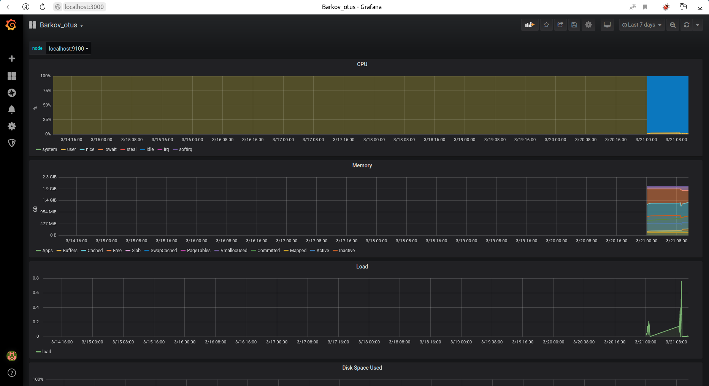

# Домашнее задание Настройка мониторинга
Описание/Пошаговая инструкция выполнения домашнего задания:
Настроить дашборд с 4-мя графиками

память;
процессор;
диск;
сеть. Настроить на одной из систем:
zabbix (использовать screen (комплексный экран);
prometheus - grafana.
использование систем, примеры которых не рассматривались на занятии. Список возможных систем был приведен в презентации. В качестве результата прислать скриншот экрана - дашборд должен содержать в названии имя приславшего.

## Проверка работоспособности
```bash
vagrant up && vagrant ssh

stress --cpu 2 --timeout 60
```

Нагрузим систему
```bash
stress --cpu 2 --timeout 60
```

Проверим, что данные передаются
http://localhost:9090/targets


## адреса систем
```
Prometheus - http://localhost:9090/
Grafana - http://localhost:3000/
```

Вход для grafana username & password  **admin**


В качестве дашборда я взял один из стандартных 405 и импортировал его
https://grafana.com/grafana/dashboards/?dataSource=prometheus&collector=nodeexporter&category=hostmetrics

https://grafana.com/grafana/dashboards/405



