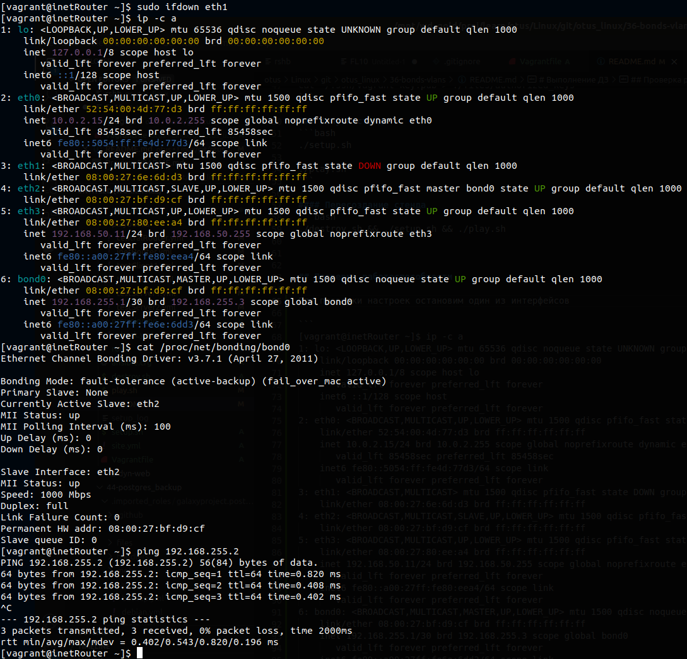

# Домашнее задание.
Строим бонды и вланы

Описание/Пошаговая инструкция выполнения домашнего задания: \
в Office1 в тестовой подсети появляется сервера с доп интерфесами и адресами \
в internal сети testLAN

- testClient1 - 10.10.10.254
- testClient2 - 10.10.10.254
- testServer1- 10.10.10.1
- testServer2- 10.10.10.1

развести вланами \
testClient1 <-> testServer1 \
testClient2 <-> testServer2 \
между centralRouter и inetRouter "пробросить" 2 линка (общая inernal сеть) и объединить их в бонд проверить работу c отключением интерфейсов \
Формат сдачи ДЗ - vagrant + ansible


# Выполнение ДЗ

## Окружение
```
Vagrant 2.2.19.dev
ansible 2.11.11
```

## Описание стэнда
| Host          | OS |
| ------------- | ----------- |
| inetRouter    | centos/7 |
| centralRouter | centos/7 |
| testServer1   | centos/7 |
| testClient1   | centos/7 |
| testServer2   | centos/7 |
| testClient2   | centos/7 |

## Развертывание стенда
### Подготовка стенда

Готовим ключ. Копируем его в подкаталог ./provision/ssh
```bash
ssh-keygen -t rsa -f ~/.ssh/vagrant-key

cat ~/.ssh/vagrant-key.pub > ./files/authorized_keys
```

### Запуск стенда
```bash
./setup.sh

./play.sh
```

#### Пересоздание стенда
```bash
./destroy.sh && ./setup.sh && ./play.sh
```


## Проверка работоспособности

Убедимся, что сервера друг друга видят, и проверим статус нашего bond-а

```
[vagrant@inetRouter ~]$ ping 192.168.255.2
PING 192.168.255.2 (192.168.255.2) 56(84) bytes of data.
64 bytes from 192.168.255.2: icmp_seq=1 ttl=64 time=0.381 ms
64 bytes from 192.168.255.2: icmp_seq=2 ttl=64 time=0.338 ms
^C
--- 192.168.255.2 ping statistics ---
2 packets transmitted, 2 received, 0% packet loss, time 999ms
rtt min/avg/max/mdev = 0.338/0.359/0.381/0.028 ms
[vagrant@inetRouter ~]$


[vagrant@centralRouter ~]$ ping 192.168.255.1
PING 192.168.255.1 (192.168.255.1) 56(84) bytes of data.
64 bytes from 192.168.255.1: icmp_seq=1 ttl=64 time=0.361 ms
64 bytes from 192.168.255.1: icmp_seq=2 ttl=64 time=0.399 ms
64 bytes from 192.168.255.1: icmp_seq=3 ttl=64 time=0.429 ms
^C
--- 192.168.255.1 ping statistics ---
3 packets transmitted, 3 received, 0% packet loss, time 2000ms
rtt min/avg/max/mdev = 0.361/0.396/0.429/0.032 ms
[vagrant@centralRouter ~]$


[vagrant@inetRouter ~]$ cat /proc/net/bonding/bond0
Ethernet Channel Bonding Driver: v3.7.1 (April 27, 2011)

Bonding Mode: fault-tolerance (active-backup) (fail_over_mac active)
Primary Slave: None
Currently Active Slave: eth2
MII Status: up
MII Polling Interval (ms): 100
Up Delay (ms): 0
Down Delay (ms): 0

Slave Interface: eth2
MII Status: up
Speed: 1000 Mbps
Duplex: full
Link Failure Count: 0
Permanent HW addr: 08:00:27:bf:d9:cf
Slave queue ID: 0

Slave Interface: eth1
MII Status: up
Speed: 1000 Mbps
Duplex: full
Link Failure Count: 0
Permanent HW addr: 08:00:27:6e:6d:d3
Slave queue ID: 0


```


Для проверки настроек остановим один из интерфейсов

```
[vagrant@inetRouter ~]$ ip -c a
1: lo: <LOOPBACK,UP,LOWER_UP> mtu 65536 qdisc noqueue state UNKNOWN group default qlen 1000
    link/loopback 00:00:00:00:00:00 brd 00:00:00:00:00:00
    inet 127.0.0.1/8 scope host lo
       valid_lft forever preferred_lft forever
    inet6 ::1/128 scope host
       valid_lft forever preferred_lft forever
2: eth0: <BROADCAST,MULTICAST,UP,LOWER_UP> mtu 1500 qdisc pfifo_fast state UP group default qlen 1000
    link/ether 52:54:00:4d:77:d3 brd ff:ff:ff:ff:ff:ff
    inet 10.0.2.15/24 brd 10.0.2.255 scope global noprefixroute dynamic eth0
       valid_lft 85458sec preferred_lft 85458sec
    inet6 fe80::5054:ff:fe4d:77d3/64 scope link
       valid_lft forever preferred_lft forever
3: eth1: <BROADCAST,MULTICAST> mtu 1500 qdisc pfifo_fast state DOWN group default qlen 1000
    link/ether 08:00:27:6e:6d:d3 brd ff:ff:ff:ff:ff:ff
4: eth2: <BROADCAST,MULTICAST,SLAVE,UP,LOWER_UP> mtu 1500 qdisc pfifo_fast master bond0 state UP group default qlen 1000
    link/ether 08:00:27:bf:d9:cf brd ff:ff:ff:ff:ff:ff
5: eth3: <BROADCAST,MULTICAST,UP,LOWER_UP> mtu 1500 qdisc pfifo_fast state UP group default qlen 1000
    link/ether 08:00:27:80:ee:a4 brd ff:ff:ff:ff:ff:ff
    inet 192.168.50.11/24 brd 192.168.50.255 scope global noprefixroute eth3
       valid_lft forever preferred_lft forever
    inet6 fe80::a00:27ff:fe80:eea4/64 scope link
       valid_lft forever preferred_lft forever
6: bond0: <BROADCAST,MULTICAST,MASTER,UP,LOWER_UP> mtu 1500 qdisc noqueue state UP group default qlen 1000
    link/ether 08:00:27:bf:d9:cf brd ff:ff:ff:ff:ff:ff
    inet 192.168.255.1/30 brd 192.168.255.3 scope global bond0
       valid_lft forever preferred_lft forever
    inet6 fe80::a00:27ff:fe6e:6dd3/64 scope link
       valid_lft forever preferred_lft forever
[vagrant@inetRouter ~]$ cat /proc/net/bonding/bond0
Ethernet Channel Bonding Driver: v3.7.1 (April 27, 2011)

Bonding Mode: fault-tolerance (active-backup) (fail_over_mac active)
Primary Slave: None
Currently Active Slave: eth2
MII Status: up
MII Polling Interval (ms): 100
Up Delay (ms): 0
Down Delay (ms): 0

Slave Interface: eth2
MII Status: up
Speed: 1000 Mbps
Duplex: full
Link Failure Count: 0
Permanent HW addr: 08:00:27:bf:d9:cf
Slave queue ID: 0
[vagrant@inetRouter ~]$ ping 192.168.255.2
PING 192.168.255.2 (192.168.255.2) 56(84) bytes of data.
64 bytes from 192.168.255.2: icmp_seq=1 ttl=64 time=0.820 ms
64 bytes from 192.168.255.2: icmp_seq=2 ttl=64 time=0.408 ms
64 bytes from 192.168.255.2: icmp_seq=3 ttl=64 time=0.402 ms
^C
--- 192.168.255.2 ping statistics ---
3 packets transmitted, 3 received, 0% packet loss, time 2000ms
rtt min/avg/max/mdev = 0.402/0.543/0.820/0.196 ms

```




Для проверки связки testClient1 <-> testServer1 используем ping
```
[vagrant@testServer1 ~]$ ping 10.10.10.254
PING 10.10.10.254 (10.10.10.254) 56(84) bytes of data.
64 bytes from 10.10.10.254: icmp_seq=1 ttl=64 time=0.640 ms
64 bytes from 10.10.10.254: icmp_seq=2 ttl=64 time=0.380 ms
^C
--- 10.10.10.254 ping statistics ---
2 packets transmitted, 2 received, 0% packet loss, time 1000ms
rtt min/avg/max/mdev = 0.380/0.510/0.640/0.130 ms


[vagrant@testClient1 ~]$ ping 10.10.10.1
PING 10.10.10.1 (10.10.10.1) 56(84) bytes of data.
64 bytes from 10.10.10.1: icmp_seq=1 ttl=64 time=0.320 ms
64 bytes from 10.10.10.1: icmp_seq=2 ttl=64 time=0.383 ms
^C
--- 10.10.10.1 ping statistics ---
2 packets transmitted, 2 received, 0% packet loss, time 1000ms
rtt min/avg/max/mdev = 0.320/0.351/0.383/0.036 ms

```


Для проверки связки testClient2 <-> testServer2 используем ping
```
[vagrant@testServer2 ~]$ ping 10.10.10.254
PING 10.10.10.254 (10.10.10.254) 56(84) bytes of data.
64 bytes from 10.10.10.254: icmp_seq=1 ttl=64 time=0.621 ms
64 bytes from 10.10.10.254: icmp_seq=2 ttl=64 time=0.475 ms
64 bytes from 10.10.10.254: icmp_seq=3 ttl=64 time=0.417 ms
^C
--- 10.10.10.254 ping statistics ---
3 packets transmitted, 3 received, 0% packet loss, time 2000ms
rtt min/avg/max/mdev = 0.417/0.504/0.621/0.087 ms


[vagrant@testClient2 ~]$ ping 10.10.10.1
PING 10.10.10.1 (10.10.10.1) 56(84) bytes of data.
64 bytes from 10.10.10.1: icmp_seq=1 ttl=64 time=0.313 ms
64 bytes from 10.10.10.1: icmp_seq=2 ttl=64 time=0.409 ms
64 bytes from 10.10.10.1: icmp_seq=3 ttl=64 time=0.381 ms
^C
--- 10.10.10.1 ping statistics ---
3 packets transmitted, 3 received, 0% packet loss, time 1999ms
rtt min/avg/max/mdev = 0.313/0.367/0.409/0.045 ms


```
