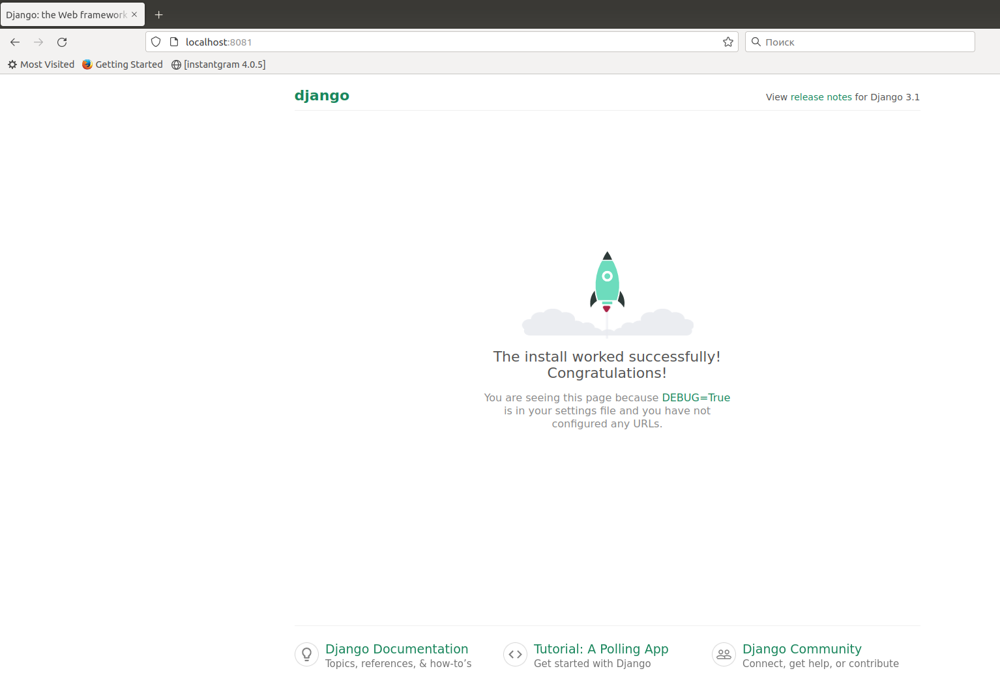

#Домашнее задание
 развертывание веб приложения

Описание/Пошаговая инструкция выполнения домашнего задания:\
Варианты стенда:

- nginx + php-fpm (laravel/wordpress) + python (flask/django) + js(react/angular);
- nginx + java (tomcat/jetty/netty) + go + ruby;
- можно свои комбинации. Реализации на выбор:
- на хостовой системе через конфиги в /etc;
- деплой через docker-compose. Для усложнения можно попросить проекты у коллег с курсов по разработке К сдаче принимается:
- vagrant стэнд с проброшенными на локалхост портами
- каждый порт на свой сайт
- через нжинкс Формат сдачи ДЗ - vagrant + ansible

## Окружение
```
Vagrant 2.2.19.dev
ansible 2.9.27
```

## Развертывание стэнда

### Запуск стенда
```bash
./setup.sh
```

#### Пересоздание стенда
```bash
./destroy.sh && ./setup.sh
```

## Проверка работоспособности
Открыть в браузере указанные ссылки:

http://localhost:8081

http://localhost:8082

http://localhost:8083





### Результат выполнения docker images на ВМ root@DynamicWeb
```
vagrant@DynamicWeb:~$ sudo su
root@DynamicWeb:/home/vagrant# docker images
REPOSITORY    TAG                  IMAGE ID       CREATED         SIZE
project_app   latest               cb7811f00b66   5 minutes ago   975MB
nginx         latest               fa5269854a5e   5 days ago      142MB
mysql         8.0                  f2ad9f23df82   5 days ago      521MB
node          16.13.2-alpine3.15   23990429c0d7   3 months ago    109MB
python        3.8.3                7f5b6ccd03e9   22 months ago   934MB
wordpress     5.1.1-fpm-alpine     9032a2781408   2 years ago     124MB

```
