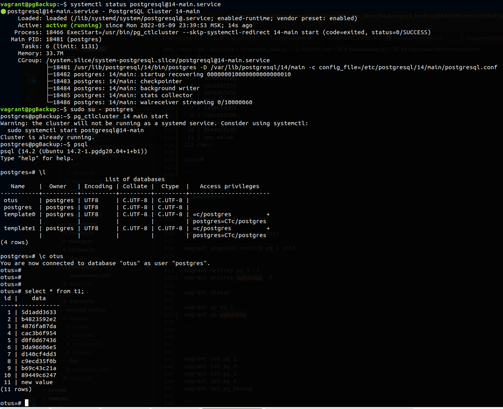

# Домашнее задание.
репликация postgres

Описание/Пошаговая инструкция выполнения домашнего задания: \
На 1 ВМ создаем таблицы test для записи, test2 для запросов на чтение. \
Создаем публикацию таблицы test и подписываемся на публикацию таблицы test2 с ВМ №2. \
На 2 ВМ создаем таблицы test2 для записи, test для запросов на чтение. \
Создаем публикацию таблицы test2 и подписываемся на публикацию таблицы test1 с ВМ №1. \
ВМ 3 использовать как реплику для чтения (подписаться на таблицы из ВМ №1 и №2 ). \
Реализовать горячее реплицирование для высокой доступности на 4ВМ и бэкапов.


# Выполнение ДЗ

Была попытка развернуть все в автоматическом режиме с помощью community.postgresql.postgresql_db, но в связи с недостатком времени вопрос отложил.

## Окружение
```
Vagrant 2.2.19.dev
ansible 2.11.11
```

## Описание стэнда
| Host      | OS |
| --------- | -------- |
| pg_1      | ubuntu/focal64 |
| pg_2      | ubuntu/focal64 |
| pg_3      | ubuntu/focal64 |
| pg_backup | ubuntu/focal64 |


## Развертывание стенда
### Подготовка стенда
Установка роли galaxyproject.postgresql

./init-base.sh

Готовим ключ. Копируем его в подкаталог ./provision/ssh
```bash
ssh-keygen -t rsa -f ~/.ssh/vagrant-key

cat ~/.ssh/vagrant-key.pub > ./files/authorized_keys
```

### Запуск стенда
```bash
./setup.sh

./play.sh
```

#### Пересоздание стенда
```bash
./destroy.sh && ./setup.sh && ./play.sh

```

### Конфигурирование стенда

#### Конфигурирование pg01
```bash
vagrant ssh pg01
sudo su - postgres
pg_lsclusters

```

Проверяем наличие строк по разрешению доступа для синхронизации с определенных ip
```bash
less /etc/postgresql/14/main/pg_hba.conf
```

```
host all all 192.168.11.192/32 trust
host all all 192.168.11.193/32 trust
host all all 192.168.11.194/32 trust
```


Проверяем наличие строк по разрешению слушать postgres на внешнем ip (локальная сеть)
```bash
less /etc/postgresql/14/main/conf.d/25ansible_postgresql.conf
```

```
listen_addresses = 'localhost, 192.168.11.191'
```


Проверяем что postgres слушает на локальном адресе и указано порту (5432)
```bash
ss -tunlp
```


Подключаемся, создаем базу, переходим в нее.
Создаем таблицу t1 и t2

Включаем wal_level для потоковой синхронизации (по умолчанию установлена replica)

```bash
sudo su - postgres
psql
```

```
create database otus;

\c otus

create table t1 as select generate_series(1,10) as id, md5(random()::text)::char(10) as data;

create table t2 as select generate_series(1,10) as id, md5(random()::text)::char(10) as data;

ALTER SYSTEM SET wal_level = logical;
```

Результат выполнения:
```
vagrant@pg01:~$ sudo su - postgres
postgres@pg01:~$ psql
psql (14.2 (Ubuntu 14.2-1.pgdg20.04+1+b1))
Type "help" for help.

postgres=# create database otus;
CREATE DATABASE
postgres=# \c otus
You are now connected to database "otus" as user "postgres".
otus=# create table t1 as select generate_series(1,10) as id, md5(random()::text)::char(10) as data;
SELECT 10
otus=# create table t2 as select generate_series(1,10) as id, md5(random()::text)::char(10) as data;
SELECT 10
otus=# ALTER SYSTEM SET wal_level = logical;
ALTER SYSTEM
otus=#

```


Обязательно рестартуем кластер
```
ctrl d
sudo pg_ctlcluster 14 main restart
```

Создаем публикацию на таблицу t1
После этого задаем пароль на подключение (123456)
```bash
sudo su - postgres
psql
```

```
\c otus
CREATE PUBLICATION t1_pub FOR TABLE t1;

\password
```


#### Конфигурирование pg02
```bash
vagrant ssh pg02
sudo su - postgres
pg_lsclusters

```

Проверяем наличие строк по разрешению доступа для синхронизации с определенных ip
```bash
less /etc/postgresql/14/main/pg_hba.conf
```

```
host all all 192.168.11.191/32 trust
host all all 192.168.11.193/32 trust
host all all 192.168.11.194/32 trust
```


Проверяем наличие строк по разрешению слушать postgres на внешнем ip (локальная сеть)
```bash
less /etc/postgresql/14/main/conf.d/25ansible_postgresql.conf
```

```
listen_addresses = 'localhost, 192.168.11.192'
```


Проверяем что postgres слушает на локальном адресе и указано порту (5432)
```bash
ss -tunlp
```


Подключаемся, создаем базу, переходим в нее.
Создаем таблицу t1 и t2

Включаем wal_level для потоковой синхронизации (по умолчанию установлена replica)

```bash
sudo su - postgres
psql
```

```
create database otus;

\c otus

create table t1 as select generate_series(1,10) as id, md5(random()::text)::char(10) as data;

create table t2 as select generate_series(1,10) as id, md5(random()::text)::char(10) as data;

ALTER SYSTEM SET wal_level = logical;
```

Результат выполнения:
```
vagrant@pg02:~$ sudo su - postgres
postgres@pg02:~$ psql
psql (14.2 (Ubuntu 14.2-1.pgdg20.04+1+b1))
Type "help" for help.

postgres=# create database otus;
CREATE DATABASE
postgres=# \c otus
You are now connected to database "otus" as user "postgres".
otus=# create table t1 as select generate_series(1,10) as id, md5(random()::text)::char(10) as data;
SELECT 10
otus=# create table t2 as select generate_series(1,10) as id, md5(random()::text)::char(10) as data;
SELECT 10
otus=# ALTER SYSTEM SET wal_level = logical;
ALTER SYSTEM
otus=#

```


Обязательно рестартуем кластер
```
ctrl d
sudo pg_ctlcluster 14 main restart
```

Создаем публикацию на таблицу t2
После этого задаем пароль на подключение (123456)
```bash
sudo su - postgres
psql
```

```
\c otus
CREATE PUBLICATION t2_pub FOR TABLE t2;

\password
```

Создадим подписку к БД по Порту с Юзером и Паролем и Копированием данных=false
```
CREATE SUBSCRIPTION t1_sub_pg01 CONNECTION 'host=192.168.11.191 port=5432 user=postgres password=123456 dbname=otus' PUBLICATION t1_pub WITH (copy_data = false);
```

```
otus=# CREATE SUBSCRIPTION t1_sub_pg01 CONNECTION 'host=192.168.11.191 port=5432 user=postgres password=123456 dbname=otus' PUBLICATION t1_pub WITH (copy_data = false);
NOTICE:  created replication slot "t1_sub_pg01" on publisher
CREATE SUBSCRIPTION
```


#### pg01
Перейдем на сервер pg01 и выполним подписку на таблицу t2 pg02
```bash
sudo su - postgres
psql
```

Создадим подписку к БД по порту с Юзером и Паролем и Копированием данных=false
CREATE SUBSCRIPTION t2_sub_pg02 CONNECTION 'host=192.168.11.192 port=5432 user=postgres password=123456 dbname=otus' PUBLICATION t2_pub WITH (copy_data = false);

```
otus=# CREATE SUBSCRIPTION t2_sub_pg02 CONNECTION 'host=192.168.11.192 port=5432 user=postgres password=123456 dbname=otus' PUBLICATION t2_pub WITH (copy_data = false);
NOTICE:  created replication slot "t2_sub_pg02" on publisher
CREATE SUBSCRIPTION
```


Проверяем подписки
```bash
sudo su - postgres
psql
\c otus
```

```
\dRp+
\dRs+
```


pg01
```
otus=# \dRp+
                             Publication t1_pub
  Owner   | All tables | Inserts | Updates | Deletes | Truncates | Via root
----------+------------+---------+---------+---------+-----------+----------
 postgres | f          | t       | t       | t       | t         | f
Tables:
    "public.t1"

otus=# \dRs+
                                                                       List of subscriptions
    Name     |  Owner   | Enabled | Publication | Binary | Streaming | Synchronous commit |                                Conninfo
-------------+----------+---------+-------------+--------+-----------+--------------------+-------------------------------------------------------------------------
 t2_sub_pg02 | postgres | t       | {t2_pub}    | f      | f         | off                | host=192.168.11.192 port=5432 user=postgres password=123456 dbname=otus
(1 row)

otus=#

```


pg02
```
otus=# \dRp+
                             Publication t2_pub
  Owner   | All tables | Inserts | Updates | Deletes | Truncates | Via root
----------+------------+---------+---------+---------+-----------+----------
 postgres | f          | t       | t       | t       | t         | f
Tables:
    "public.t2"

otus=# \dRs+
                                                                       List of subscriptions
    Name     |  Owner   | Enabled | Publication | Binary | Streaming | Synchronous commit |                                Conninfo
-------------+----------+---------+-------------+--------+-----------+--------------------+-------------------------------------------------------------------------
 t1_sub_pg01 | postgres | t       | {t1_pub}    | f      | f         | off                | host=192.168.11.191 port=5432 user=postgres password=123456 dbname=otus
(1 row)

otus=#

```


SELECT * FROM pg_stat_subscription \gx


#### Конфигурирование pg03
```bash
vagrant ssh pg03
sudo su - postgres
pg_lsclusters

```

Проверяем наличие строк по разрешению доступа для синхронизации с определенных ip
```bash
less /etc/postgresql/14/main/pg_hba.conf
```

```
host all all 192.168.11.191/32 trust
host all all 192.168.11.192/32 trust
host replication postgres 192.168.11.194/32 trust
```


Проверяем наличие строк по разрешению слушать postgres на внешнем ip (локальная сеть)
```bash
less /etc/postgresql/14/main/conf.d/25ansible_postgresql.conf
```

```
listen_addresses = 'localhost, 192.168.11.193'
```


Проверяем что postgres слушает на локальном адресе и указано порту (5432)
```bash
ss -tunlp
```


Подключаемся, создаем базу, переходим в нее.
Создаем таблицу t1 и t2

Включаем wal_level для потоковой синхронизации (по умолчанию установлена replica)

```bash
sudo su - postgres
psql
```

```
create database otus;

\c otus

create table t1 as select generate_series(1,10) as id, md5(random()::text)::char(10) as data;

create table t2 as select generate_series(1,10) as id, md5(random()::text)::char(10) as data;

ALTER SYSTEM SET wal_level = logical;
```


Обязательно рестартуем кластер
```
ctrl d
sudo pg_ctlcluster 14 main restart
```


-> создадим подписку на сервер pg01
CREATE SUBSCRIPTION t1_sub_pg01_to_pg03 CONNECTION 'host=192.168.11.191 port=5432 user=postgres password=123456 dbname=otus' PUBLICATION t1_pub WITH (copy_data = false);

-> создадим подписку на сервер pg02
CREATE SUBSCRIPTION t2_sub_pg02_to_pg03 CONNECTION 'host=192.168.11.192 port=5432 user=postgres password=123456 dbname=otus' PUBLICATION t2_pub WITH (copy_data = false);


Проверяем подписки
```bash
sudo su - postgres
psql
\c otus
```

```
\dRs+
```


```
otus=# \dRs+
                                                                           List of subscriptions
        Name         |  Owner   | Enabled | Publication | Binary | Streaming | Synchronous commit |                                Conninfo
---------------------+----------+---------+-------------+--------+-----------+--------------------+-------------------------------------------------------------------------
 t1_sub_pg01_to_pg03 | postgres | t       | {t1_pub}    | f      | f         | off                | host=192.168.11.191 port=5432 user=postgres password=123456 dbname=otus
 t2_sub_pg02_to_pg03 | postgres | t       | {t2_pub}    | f      | f         | off                | host=192.168.11.192 port=5432 user=postgres password=123456 dbname=otus
(2 rows)

```


#### Конфигурирование pgBackup
```bash
vagrant ssh pgBackup
sudo su - postgres
pg_lsclusters

```

Проверяем наличие строк по разрешению доступа для синхронизации с определенных ip
```bash
less /etc/postgresql/14/main/pg_hba.conf
```

```
host all all 192.168.11.193/32 trust
```


Проверяем наличие строк по разрешению слушать postgres на внешнем ip (локальная сеть)
```bash
less /etc/postgresql/14/main/conf.d/25ansible_postgresql.conf
```

```
listen_addresses = 'localhost, 192.168.11.194'
```


Удаляем данные из кластера, таким образом подготавливаем его к синхронизации
```bash
sudo su - postgres
rm -rf /var/lib/postgresql/14/main
```

Восстанавливаем папку базы main
```bash
cd /var/lib/postgresql/14/ && mkdir main && chmod go-rwx main
pg_basebackup -P -R -X stream -c fast -h 192.168.11.193 -D main

--pg_lsclusters
```

CTRL+D

```bash
sudo systemctl restart postgresql*
systemctl status postgresql@14-main.service
```

```
vagrant@pgBackup:~$ sudo systemctl restart postgresql*
vagrant@pgBackup:~$ systemctl status postgresql@14-main.service
● postgresql@14-main.service - PostgreSQL Cluster 14-main
     Loaded: loaded (/lib/systemd/system/postgresql@.service; enabled-runtime; vendor preset: enabled)
     Active: active (running) since Mon 2022-05-09 23:39:53 MSK; 14s ago
    Process: 18466 ExecStart=/usr/bin/pg_ctlcluster --skip-systemctl-redirect 14-main start (code=exited, status=0/SUCCESS)
   Main PID: 18481 (postgres)
      Tasks: 6 (limit: 1131)
     Memory: 33.7M
     CGroup: /system.slice/system-postgresql.slice/postgresql@14-main.service
             ├─18481 /usr/lib/postgresql/14/bin/postgres -D /var/lib/postgresql/14/main -c config_file=/etc/postgresql/14/main/postgresql.conf
             ├─18482 postgres: 14/main: startup recovering 000000010000000000000010
             ├─18483 postgres: 14/main: checkpointer
             ├─18484 postgres: 14/main: background writer
             ├─18485 postgres: 14/main: stats collector
             └─18486 postgres: 14/main: walreceiver streaming 0/10000060

```


## Проверка работоспособности
```bash
vagrant ssh pg01
sudo su - postgres
psql
\c otus

```

```
insert into t1 values (11, 'new value');
```


На всех БД в результате выполнения запроса должно получиться 11 записей \
select * from t1;


```
vagrant@pgBackup:~$ sudo su - postgres
postgres@pgBackup:~$ psql
psql (14.2 (Ubuntu 14.2-1.pgdg20.04+1+b1))
Type "help" for help.

postgres=# \l
                              List of databases
   Name    |  Owner   | Encoding | Collate |  Ctype  |   Access privileges
-----------+----------+----------+---------+---------+-----------------------
 otus      | postgres | UTF8     | C.UTF-8 | C.UTF-8 |
 postgres  | postgres | UTF8     | C.UTF-8 | C.UTF-8 |
 template0 | postgres | UTF8     | C.UTF-8 | C.UTF-8 | =c/postgres          +
           |          |          |         |         | postgres=CTc/postgres
 template1 | postgres | UTF8     | C.UTF-8 | C.UTF-8 | =c/postgres          +
           |          |          |         |         | postgres=CTc/postgres
(4 rows)

postgres=# \c otus
You are now connected to database "otus" as user "postgres".
otus=#
otus=#
otus=#
otus=# select * from t1;
 id |    data
----+------------
  1 | 5d1add3633
  2 | b4823592e2
  3 | 4876fa07da
  4 | cac3b6f954
  5 | d0f6d67436
  6 | 3da96606e5
  7 | d140cf4dd3
  8 | c9ecd35f0b
  9 | b69c43c21a
 10 | 89449c6247
 11 | new value
(11 rows)

otus=#

```




# Приложение

```
vagrant snapshot save init

vagrant snapshot restore init

vagrant snapshot restore pg_1 init


vagrant destroy pg_1 -f
vagrant destroy pgBackup -f

vagrant status

vagrant up pg_1
vagrant up pgBackup

```


```
vagrant ssh pg_1
vagrant ssh pg_2
vagrant ssh pg_3
vagrant ssh pg_4
vagrant ssh pg_backup

```
