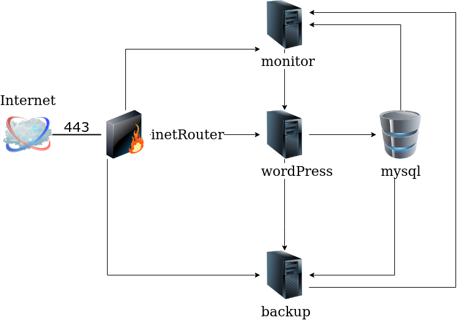

# Выпускной проект курса "Administrator Linux. Professional"

Исходное задание:
Создание рабочего веб-проекта с развертыванием нескольких виртуальных машин.

Отвечает следующим требованиям:
- включен https
- основная инфраструктура в DMZ зоне
- файрвалл на входе
- сбор метрик и настроенный алертинг
- везде включен selinux
- организован централизованный сбор логов
- организован backup базы

# Тема: Развертывание инфраструктуры для веб-портала с помощью ansible

Проект представляет собой сеть из пяти серверов:




Сервисы на машинах поднимаются с помощью Ansible.

- **Bastion server** - маршрутизатор-файрволл на входе сети
- **Web server** - сервер с фронтэндом и бэкэндом
- **Mysql server** - сервер баз данных
- **Backup server** - сервер для бэкапов и сбора логов
- **Monitor server** - сервер мониторинга

Основные компонеты ВМ:

## Общие для всех ВМ

На каждой машине добавляется репозиторий `epel-release`.

Также устанавливается prometheus-node-exporter-агент.

## ВМ wordpressServer
Здесь устанавливаются:
- php-fpm
- nginx
- wordpress
- Клиент rsyslog

Nginx перенаправляет запросы с 80 на 443 порт для безопасного соединения.
С php-fpm общается через unix-сокет, чтобы избежать затрат на tcp.


## ВМ mysqlServer
Здесь устанавливаются:
- mariadb
- Клиент rsyslog

На этом серевере БД размещена БД Wordpress.

С базы делается бекап mysqldump и borgbackup, вызываемые по таймеру systemd.

## ВМ inetRouter
Здесь решается задача передачи пакетов между портами и настраивается `iptables`: настроен проброс портов до nginx, весь остальной трафик из интернета дропается.

## ВМ backupsServer
Здесь устанавливается:
- borgbackup server
- rsyslog server


## ВМ monitorServer
Здесь устанавливается:
- prometeus server
- Grafana

Дефолтные учетные данные: `admin/admin`

## Развертывание стенда
### Подготовка стенда
Установка ролей

./init-base.sh

Готовим ключ. Копируем его в подкаталог ./provision/ssh
```bash
ssh-keygen -t rsa -f ~/.ssh/vagrant-key

cat ~/.ssh/vagrant-key.pub > ./files/authorized_keys
```

### Запуск стенда
```bash
./setup.sh

./play.sh
```

#### Пересоздание стенда
```bash
./destroy.sh && ./setup.sh && ./play.sh

```


# Проверка
## Prometheus
http://localhost:9090/targets
http://localhost:9100/metrics


## Grafana
http://localhost:3000/


## Wordpress

https://192.168.10.10/


## Проверка бэкапов
### Проверяем работу сервиса бэкапов
```bash
systemctl status borg-backup.service

```


```
[root@mysqlServer backup]# systemctl status borg-backup.service
● borg-backup.service - Borg backup
   Loaded: loaded (/etc/systemd/system/borg-backup.service; static; vendor preset: disabled)
   Active: inactive (dead) since Tue 2022-06-14 19:06:31 MSK; 19s ago
  Process: 8096 ExecStart=/opt/borgbackup.sh (code=exited, status=0/SUCCESS)
 Main PID: 8096 (code=exited, status=0/SUCCESS)

Jun 14 19:06:31 mysqlServer root[8102]: This archive:                1.03 MB            439.55 kB            220.31 kB
Jun 14 19:06:31 mysqlServer root[8102]: All archives:                1.55 MB            659.78 kB            440.55 kB
Jun 14 19:06:31 mysqlServer root[8102]:
Jun 14 19:06:31 mysqlServer root[8102]:                        Unique chunks         Total chunks
Jun 14 19:06:31 mysqlServer root[8102]: Chunk index:                       6                    7
Jun 14 19:06:31 mysqlServer root[8102]: ------------------------------------------------------------------------------
Jun 14 19:06:31 mysqlServer borgbackup.sh[8096]: Keeping archive: 2022-06-14-19-06                     Tue, 2022-06-14 19:06:31 [f8c3e0af1e9ea316dd63bc39c8ed92001bb32970625ab1869dac3e21e2299353]
Jun 14 19:06:31 mysqlServer borgbackup.sh[8096]: Pruning archive: 2022-06-14-19-05                     Tue, 2022-06-14 19:05:36 [92850e9d6619a743fb68a5e5d95338fdae952433fef4e4ec249f4856b151e126] (1/1)
Jun 14 19:06:31 mysqlServer borgbackup.sh[8096]: terminating with success status, rc 0
Jun 14 19:06:31 mysqlServer systemd[1]: Started Borg backup.

```

### Проверка извлечения из бэкапа

```bash
rm -Rf /var/lib/mysql/backup/*

export BORG_PASSPHRASE="otus"
```


Список всех бэкапов
```bash
borg list borg@192.168.30.5:/var/backup/
```


Смотрим бэкап за дату, например 2022-06-14-19-00
```bash
borg list borg@192.168.30.5:/var/backup/::2022-06-14-19-00
```

Извлекаем бэкап
```bash
borg extract borg@192.168.30.5:/var/backup/::2022-06-14-19-00 var/lib/mysql/backup/all_databases.sql
```


Восстановление БД
```bash
mysql -u root -p < var/lib/mysql/backup/all_databases.sql
```

## Логи

```bash
cd /var/log/rsyslog/
```


## nginx
```bash
less /etc/nginx/nginx.conf

less /etc/nginx/conf.d/site.project.conf

nginx -t && nginx -s reload


https://docs.nginx.com/nginx/admin-guide/dynamic-modules/brotli/

```